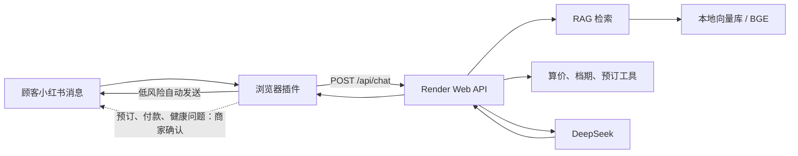

# 🐱🐶 宠物寄养商家智慧客服

面向宠物寄养商家的 AI 客服项目：将寄养规则、养宠知识和档期数据接入 **RAG（检索增强生成）** 后端，并通过浏览器插件嵌入小红书网页版聊天场景，辅助商家及时处理顾客咨询。

项目包含三层能力：

- 云端 RAG 后端：知识问答、来源引用、确定性报价、档期查询与演示预订。
- 网页管理/演示界面：便于单独体验后端能力。
- 小红书网页插件：自动读取顾客侧新消息；普通咨询可自动回复，预订、取消、付款和健康类问题要求商家确认。

> 本项目是「大模型应用开发实习」作品集项目。当前在线演示后端部署在 Render：<https://pet-care-rag-demo.onrender.com>。

## ✨ 功能

- ✅ 文档自动解析 + 切片（支持 .md / .txt）
- ✅ 本地向量化（BGE 中文模型，免费）
- ✅ 向量检索 + LLM 生成（DeepSeek API）
- ✅ 回答带参考来源（引用溯源）
- ✅ 自然语言询价、缺参追问、基础费用工具调用（当前会话）
- ✅ 自然语言档期查询、明确确认后保存本地演示预订、跨会话共享余位
- ✅ Render 云端部署，提供 `/health` 与 `/api/chat` 接口
- ✅ Edge / Chrome Manifest V3 插件嵌入小红书网页版聊天
- ✅ 监听顾客侧新消息、自动填充与低风险咨询自动发送
- ✅ 高风险操作（预订、取消、付款、健康问题）保留商家确认

## 🛠 技术栈

| 环节 | 技术 |
|---|---|
| 后端框架 | Python + LangChain |
| 向量化 | BGE-small-zh-v1.5（sentence-transformers） |
| 向量数据库 | Chroma（本地持久化） |
| 大模型 | DeepSeek API（OpenAI 兼容接口） |
| 云部署 | Docker + Render |
| 商家侧接入 | Edge / Chrome Extension（Manifest V3） |

## 🧭 系统架构



插件只负责小红书页面接入和风险分流，业务规则与模型调用集中在后端，便于替换前端渠道并统一审计。

## 📁 项目结构

```
pet-care-rag/
├── app/
│   ├── config.py        # 配置（Key、切片参数、模型名）
│   ├── ingestion.py     # 文档读取 + 切片
│   ├── vector_store.py  # 向量化 + Chroma 存储
│   ├── retrieval.py     # 检索 + Prompt + 生成
│   ├── chat.py          # 工具选择、参数校验、多轮追问
│   ├── pricing.py       # 确定性基础算价
│   ├── bookings.py      # SQLite 共享订单、逐日余位与事务占位
│   └── main.py          # 命令行入口
├── data/
│   ├── documents/       # 👈 把你的知识文档放这里（.md/.txt）
│   ├── archive/         # 已废弃的历史资料（不会进入 RAG 索引）
│   ├── pricing_rules.json # 算价工具使用的结构化价格规则
│   ├── booking_capacity.json # 模拟房型容量
│   ├── bookings.sqlite3 # 首次查位自动创建，不提交版本库
│   └── vector_store/    # 向量库（自动生成）
├── evaluation/
│   ├── retrieval_cases.json  # 检索评测题与标准来源
│   └── retrieval_eval.py     # 自动计算 Recall@k、MRR@k
├── extension/                # 小红书网页版智慧客服浏览器插件
│   ├── manifest.json
│   ├── content.js            # 页面监听、生成回复、自动发送与风险分流
│   └── content.css
├── .env.example         # 环境变量模板
└── requirements.txt     # 依赖清单
```

## 🚀 快速开始

### 第 1 步：安装 Python 和依赖

1. 安装 **Python 3.11、3.12 或 3.13**（[python.org](https://www.python.org/downloads/) 或 Anaconda）
2. 安装 [VS Code](https://code.visualstudio.com/)（装 Python 插件）
3. 打开终端，进入项目目录，创建虚拟环境并安装依赖：

```bash
cd pet-care-rag
python -m venv .venv
# Windows:
.venv\Scripts\activate
# Mac/Linux:
# source .venv/bin/activate

pip install -r requirements.txt
```

> 国内下载模型慢时，先执行 `set HF_ENDPOINT=https://hf-mirror.com`（Windows）再运行。

### 第 2 步：配置 API Key

1. 到 [platform.deepseek.com](https://platform.deepseek.com) 注册，充值 10 元即可
2. 复制 `.env.example` 为 `.env`，填入你的 Key：

```bash
DEEPSEEK_API_KEY=sk-你的key
```

### 第 3 步：运行

```bash
python -m app.main
```

首次运行会自动读取 `data/documents/` 下的文档建立索引，然后进入问答模式：

```
❓ 你的问题: 猫可以吃巧克力吗？
💬 猫不能吃巧克力。巧克力中含有可可碱和咖啡因……
📎 参考来源：
   - data/documents/猫可以吃巧克力吗.md
```

### 常用命令

```bash
python -m app.main --rebuild   # 修改/新增文档后，强制重建索引
python -m app.main --status    # 查看资料数和当前索引切片数（不调用 API）
python -m app.main --debug     # 自然语言聊天，显示工具选择、参数和结果
```

日常体验使用 `python -m app.main`（不带 `--debug`）：只显示回答和文档来源名称，不打印内部工具记录；终端会将 Markdown 加粗标记转换为普通文字。`--debug` 是开发排错/学习模式，才显示原始 JSON。

`--rebuild` 会先删除整个旧索引，再根据当前 `data/documents/` 中的 `.md`、`.txt` 文件重新生成，避免旧切片残留或重复。
索引重建只使用本地 embedding 模型；只有实际提问时才会调用 DeepSeek API。

## 🧩 小红书网页插件演示（推荐面试展示）

插件运行在商家已经登录的小红书**网页版**中，调用本项目部署在 Render 的 `/api/chat` 接口生成回复。它不会要求商家在浏览器中填写 DeepSeek Key；密钥只保存在服务端环境变量中。

### 安装与使用

1. 使用电脑 Edge 或 Chrome 打开 `edge://extensions`（Chrome 为 `chrome://extensions`）。
2. 打开“开发人员模式”，点击“加载解压缩的扩展”。
3. 选择本仓库的 `extension/` 文件夹。
4. 登录小红书网页版，进入消息会话并刷新页面。
5. 打开右下角“宠物寄养智慧客服”，勾选“自动监听新消息”。

普通寄养咨询会生成并自动发送回复；涉及预订、取消、付款或健康风险的内容只填入小红书输入框，由商家检查确认后发送。插件可拖动、收起，并显示构建标记方便确认加载的是最新版本。

> 这是桌面浏览器插件，不能直接运行在小红书手机 App 内。若要面向手机商家，需要把客服能力做成移动端后台、独立 App，或接入平台开放的官方消息能力。

## 🌐 网页演示（后端能力体验）

命令行功能验证后，可启动本地网页聊天界面：

```powershell
.\.venv\Scripts\python.exe -m app.web
```

然后打开 <http://127.0.0.1:8000>。网页复用同一套 RAG、算价、档期、预订和取消逻辑；终端显示的模型工具记录不会出现在顾客界面。按 `Ctrl+C` 停止网页服务。

Windows 下也可以直接双击项目根目录的 `start_web.bat`：它会启动本地服务并自动打开浏览器。当前地址只在本机可访问；要让面试官从其他电脑直接访问，还需要部署到云服务器。

### 云部署准备

项目已提供 `Dockerfile`，云平台启动时会执行 `python -m app.web`，并读取平台注入的 `DEEPSEEK_API_KEY`、`DEEPSEEK_BASE_URL`、`DEEPSEEK_MODEL` 环境变量。健康检查地址为 `/health`。本地订单数据库和向量库不打包进镜像，生产环境需要单独配置持久化存储或数据库。

运行指标地址为 `/metrics`，返回请求数、成功数、错误数、限流数和平均延迟，便于面试现场展示可观测性。`/api/chat` 默认按客户端每分钟限制 30 次，可通过 `RATE_LIMIT_PER_MINUTE` 调整；当前限流和指标保存在进程内，生产环境应迁移到 Redis/API 网关并补充用户鉴权。

## 📚 知识库规则

具体价格、退改、入住资格等业务事实只以权威规则文档为准；FAQ 是简短入口，历史资料放在 `data/archive/`，不会进入检索。详见 [知识库治理说明](docs/知识库治理.md)。

## 📊 检索评测

每次调整资料、切分或检索逻辑后，先重建索引，再运行下面命令。评测不调用 DeepSeek API，只计算正确资料是否进入 top-k：

```bash
python evaluation/retrieval_eval.py
```

报告会写入 `docs/检索评测报告.md`，包含整体和分类的 Recall@5、MRR，以及未命中的问题。

## 💰 确定性算价工具

涉及价格、优惠和节假日上浮时，不让大模型自行心算，而是由本地代码按结构化规则计算：

```bash
python -m app.pricing --pet-type 狗 --dog-size 中型 --days 10 --holiday 春节
python -m unittest discover -s tests
```

第一条会输出逐步计算过程；第二条会验证代表性价格规则。当前工具覆盖基础寄养费、节假日上浮与长住优惠，洗澡、接送等增值服务将在后续迭代加入。

客户也可以在 `python -m app.main --debug` 中直接问“我家狗寄养七天多少钱”。助手会追问体型和时段，信息齐全后调用算价工具；知识问题继续走 RAG。每次聊天会调用 DeepSeek API。
请跟着 [自然语言算价体验](docs/自然语言算价体验.md) 依次体验完整询价、追问、切回知识问答。当前只支持单宠、全程同类时段的基础报价，跨档期、多宠和增值服务总价会说明暂不支持。记忆限当前会话最近8轮，输入 `/clear` 清空。

## 📅 共享档期与演示预订

直接问“猫标准间2026年10月1日至4日有位置吗”。明确提出预订后先展示草案，下一条输入“确认预订”才保存；其他终端随后查询会读到更新后的余位。日期包含结束日，清空聊天不删除订单。默认猫标准间容量为2，已有1笔预订后仍剩1个位置。

这是本地模拟数据，不涉及真实门店、支付或身份认证。已保存订单可在同一会话说“取消我刚才的预订”，或在新会话提供订单编号取消；取消会释放档期并保留取消记录。按 [共享预订体验](docs/共享预订体验.md) 用两个终端亲手验证。订单独立存储，不需要重建向量索引。

## ✅ 验收标准（跑通即达标）

1. 问「猫可以吃巧克力吗？」→ 返回基于文档的回答（提到可可碱中毒）
2. 问「我家狗寄养七天多少钱？」→ 追问体型和时段；补充「中型犬，普通时段」后报价743.40元
3. 问「狗狗能寄养吗？」→ 回答中标注来源文件
4. 问「今天天气怎么样？」→ 回答"资料中没有相关内容"（不瞎编 = 抑制幻觉成功）

## 📌 下一步（面试进阶）

- [ ] 三层知识库：宠物档案库 + 服务条款库 + 养宠知识库，交叉检索
- [ ] Rerank 重排序，量化准确率提升
- [x] Web 服务 + Docker + Render 在线 Demo
- [x] 小红书网页插件接入与低风险自动回复
- [ ] 商家账号、接口鉴权、Redis 分布式限流与持久化对话审计
- [ ] 接入平台官方消息开放能力或建设移动端商家后台
- [ ] 写技术博客记录踩坑过程
